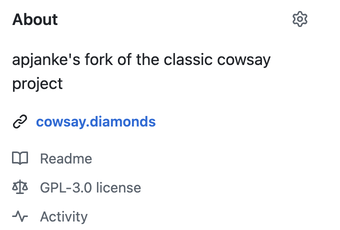
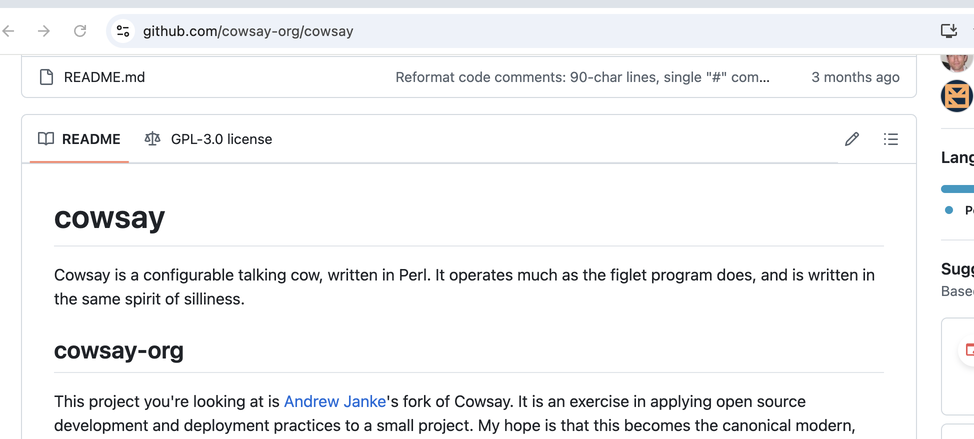

# Licensing for Cowsay

This document is Andrew Janke's understanding and view of Cowsay's licensing situation, written in 2024. It is not authoritative; just my understanding. And it is definitely a work in progress.

## Summary

I'm not entirely sure what the effective license for Cowsay is. I think it's multi-licensed (use any) under Artistic License 1.0, GPL 1.0, and GPL 3.0, with the GPL 3.0 grant maybe not applying to all files.

As of mid 2024, I'm working on a little project to clear up the licensing here. Trying to document it, get things sorted so it's easier for Free Software packages like Linux distros to package cowsay, and be consistent with our licensing approach going forward.

My current thinking is that:

1. The project as a whole, in its current state, is covered under "GNU GPL 3 or later", and you can treat this as a GPL-3.0-or-later project.
1. Most, but not all, of its files are also dual licensed under a broader "GNU GPL 1 or later or Artistic License 1.0" grant.
1. The licensing situation and provenance for some code, namely cow files contributed to the original cowsay by authors besides Tony Monroe, is unclear or unknown.
1. All new code starting December 2024 is licensed under "GNU GPL 1 or later or Artistic License 1.0", with some documentation.

## Analysis

The licensing situation for parts of Cowsay is a little unclear as of 2024-08. Cowsay was originally licensed under a custom license grant statement like this in the LICENSE file, up through version 3.03 AFAICT.

```
cowsay is distributed under the same licensing terms as Perl: the
Artistic License or the GNU General Public License.  If you don't
want to track down these licenses and read them for yourself, use
the parts that I'd prefer[...]
```

It doesn't specify a particular version of the GPL. I think that means either v1, or whatever version(s) and license application terms Perl was using as of May 2000 (or Nov 2002, when "blowfish" was committed), per that "same licensing terms" statement.

In the [rank-amateur-cowsay GitHub repo post](https://github.com/tnalpgge/rank-amateur-cowsay), in a 2016-06-24 [commit 99058032db7](), the licensing info in the repo was changed to say specifically GPLv3, and references to the Artistic License were removed. The LICENSE file was changed to a copy of the GPL v3.0, and an entry added to the ChangeLog says "Licensing terms have changed to GPLv3" (with no "or later" clause).

```
  - Licensing terms have changed to GPLv3.
```

It's unclear to me whether that "actually worked" to apply GPLv3 to the files contributed by other authors, if they weren't already covered by GPLv3 via the previous licensing terms. There's no formal copyright assignment or contributor licensing agreement.

This commit changing the licensing terms to GPL 3 was the final commit in that Git repo's commit history. So I think, if that change did have the effect of making new code be licensed only under GPL 3 (with no "or later", and now GPL 1/2 or Artistic License), no new code was actually added while that changed license application was in effect, so all the code in the repo is licensed under the older "GPL 1 or later or Artistic License" terms.

My non-expert view is that this means that Cowsay, at least all the code that was in there as of Nov 2002, is dual licensed under Artistic License and the GPL that Perl used, and the 2022 re-licensing adds a GPLv3 specific license grant, except maybe for files by authors besides Tony, without removing the effect of the old grants. You can't retroactively revoke or reduce the scope of a FLOSS license grant, I think.

The Perl license (found at <https://dev.perl.org/licenses/>, and checked 2024-11-30) looks like it's dual licensed under GPL 1.0+ and Artistic License 1.0. From that license page:

> Perl5 is Copyright (C) 1993-2005, by Larry Wall and others.
>
> It is free software; you can redistribute it and/or modify it under the terms of either:
>
> a) the GNU General Public License as published by the Free Software Foundation; either version 1, or (at your option) any later version, or
>
> b) the "Artistic License".

As of 2024-08, the cowsay-org fork doesn't have a formal contributor licensing or copyright assignment agreement. And since posting the fork, I've been referring to Cowsay as GPLv3, including in the in-repo documentation and GitHub license label. So you could make an argument that code contributed by new authors to cowsay-org since the fork is implicitly GPLv3, and not Artistic License or older GPL. Probably need a lawyer to say anything there with confidence, though.

As of 2024-08-25, I'm working on clearing this situation up and documenting it better. Work is being done under issue [#64 "Extra cows in Debian"](https://github.com/cowsay-org/cowsay/issues/64).

The `classic-docs-archive/` directory under this `doc-project/` dir contains copies of the original files from classic Cowsay as of those relevant 3.03 and 3.04 states, to help understand this situation.

The Homebrew maintainers seem to believe that Cowsay is effectively multi-licensed under Artistic License 1.0 and GPL 1.0 or later. It's discussed in [#61717 "cowsay: Don't install offensive ASCII art"](https://github.com/Homebrew/homebrew-core/pull/61717). Comment from dawidd6:

> Author states in the LICENSE file, that their software is licensed the same way perl is, so it should be changed to:
>
> ```license any_of: ["Artistic-1.0-Perl", "GPL-1.0-or-later"]```

I think that view is basically correct.

For my forked cowsay-org project, from 2016 to November 2024, I had the "GPL v3" language from the original repo's final state in my README and LICENSE.txt files. And I wasn't using a contributor license agreement or the like. So I think any implicit license granted by contributors by making PRs to that repo was just a GPL v3 license. And that's an area of code that diverges from the broader "GPL 1 or later or Artistic License" grant on the rest of the prior existing code in the project.

GitHub's terms of service have a [D.6. "Contributions Under Repository License" section](https://docs.github.com/en/site-policy/github-terms/github-terms-of-service#6-contributions-under-repository-license) that explicitly states that when you add content to a repo containing a license notice, you're licensing it under those terms. My repo had GPLv3 as its LICENSE.txt file and showed up in the GitHub web UI as "GPL-3.0". Here's screenshots from 2024-11-30:





So I think it's pretty clear that code added from 2016 to November 2024 by third-party contributors was licensed under GPLv3, and you could make a good case that that's it, and it doesn't have the extended "GPL 1 or later or Artistic License" application.

### Fedora's view

Fedora's [cowsay package](https://src.fedoraproject.org/rpms/cowsay/tree/rawhide), based on cowsay-org, labels the package as `License: GPL-2.0-or-later`. That might reflect their patches: they add a []`cowsay.bashcomp`](https://src.fedoraproject.org/rpms/cowsay/blob/rawhide/f/cowsay.bashcomp) file which is licensed under GPL 2.0. So GPL-2.0-or-later would be the intersection of the original cowsay "GPL 1+ or Artistic" grant and the GPL-2.0 grant on the cowsay.bashcomp file, though I think the "or-later" would be wrong in that case, because I don't see an "or later" on cowsay.bashcomp's license application.

### Cowsay 4

It looks like there was a "Cowsay 4" release that didn't make it in to Tony's rank-amateur-cowsay GitHub repo, but did get posted on MetaCPAN as package Acme-Cow, with versions going up to 0.2.1. The Acme-Cow distribution captured on the Wayback Machine copy of Tony's Cowsay page was 0.1. OpenBSD is using this Acme-Cow 0.2.1 for their cowsay package as of 2022 or so. I don't see license info in their metadata.

### Individual cows

The provenance and license grant for individual cows supplied by third-party authors (not Tony Monroe) is a little unclear. Maybe the fact that they were contributed to the Cowsay project while it had that "GPL 1 or later or Artistic License" licensing documented means they were all implicitly licensed under that. But maybe not - there isn't documentation to say where all those cows came from or whether they were actually "contributed" by their authors, I guess.

Debian seems to have the view that some of the contributed cows are licensed differently. The `debian/copyright` file in their cowsay source package shows differing licenses for a couple of the files, aside from the varying copyright notices for cows from different authors. This includes:

* apt.cow - GPL
* gnu.cow, suse.cow - WTFPL-2
* kangaroo.cow - GPL-2+

A copy of that Debian copyright file, from that 3.03+dfsg2-8 version, is here at `licensing-docs/ebian-cowsay-copyright_3.03+dfsg2-8.txt`, for reference.

To clear things up, maybe I could pull in the `debian/copyright` file there, and expand it to cover the new cows I added in my forked project, noting the GPLv3 or other licenses. Then go back and see if I could get expanded license grants from those contributors to unify things to the main COWSAY license terms.

Fedora has another view. Their cowsay package spec, based on my cowsay-org distribution, is currently removing `daemon.cow` due to a "license issue". I don't know if that's a FLOSS copyright license provenance issue, or a trademark issue with the FreeBSD mascot, or something else. From their cowsay.spec:

```
# Install actions specific to the Fedora package

# License issue
rm -f $RPM_BUILD_ROOT%{_datadir}/%{name}/cows/daemon.cow
```


## Copyright statement

The original cowsay LICENSE file had this statement. And it wasn't updated with commits done in later years.

```
(0) Copyright (c) 1999 Tony Monroe.  All rights reserved.  All
lefts may or may not be reversed at my discretion.
```

I think that means an up to date formal copyright statement, in Debian style, would look like the following, plus additional entries for all the files contributed by other authors:

```
Copyright 1999-2002 Tony Monroe
Copyright 2016-2024 Andrew Janke
```

## History of my work

I started looking in to this licensing situation in early 2024.

On November 30, 2024, I re-licensed all my own contributions to Cowsay to expand the license grant to be "GNU GPL 1 or later or Artistic License 1.0". That's consistent with what I think the original licensing situation was, and gives good compatibility with future changes to the licensing or our understanding of it. At the same time, I updated the LICENSE.txt and README.md to say "GPL 3 or later" instead of just "GPL 3", and note how the license situation is somewhat unclear.

Starting November 30, 2024, I started asking all contributors to license their work under (what I think is) the original Cowsay "GPL 1+ or Artistic" terms. That corresponds to commit 773c087 ("Add among us crewmate cow"). I hadn't yet updated the license files on the main branch yet, so GitHub's UI and the README still said GPL-3.0.

## Provenance

Info about where the licensing information and documentation for particular cows and code comes from.

### alpaca.cow

From Joel Maximilian Mai <joel@maispace.de>. Originally contributed 2022-11-07 via [PR #33](https://github.com/cowsay-org/cowsay/pull/33)  on the cowsay-org repo, while its "GPLv3 only" licensing statement was in effect. License grant expanded to "GPLv1+ & Artistic 1.0" on 2024-12-01 via [this comment on the PR](https://github.com/cowsay-org/cowsay/pull/33#issuecomment-2510206345) and [this approving comment](https://github.com/cowsay-org/cowsay/pull/75#issuecomment-2510220481) on [PR #75](https://github.com/cowsay-org/cowsay/pull/75) which updated the copyright documentation for alpaca in this repo.

### cupcake.cow

From Nuthan B <64555950+NuthanB@users.noreply.github.com>. Originally contributed 2023-03-18 via [PR #37](https://github.com/cowsay-org/cowsay/pull/37) on the cowsay-org repo, while its "GPLv3 only" licensing statement was in effect. License grant expanded to "GPLv1+ & Artistic 1.0" on 2024-12-03, via [this comment on the PR](https://github.com/cowsay-org/cowsay/pull/37#issuecomment-2514458219).

### llama.cow

From con-f-use <con-f-use@users.noreply.github.com>. Originally contributed 2020-05-08 via [PR #4](https://github.com/cowsay-org/cowsay/pull/4) on the cowsay-org repo, while its "GPLv3 only" licensing statement was in effect. License grant expanded to "GPLv1+ & Artistic 1.0" on 2024-12-01, via [this comment on the PR](https://github.com/cowsay-org/cowsay/pull/4).
